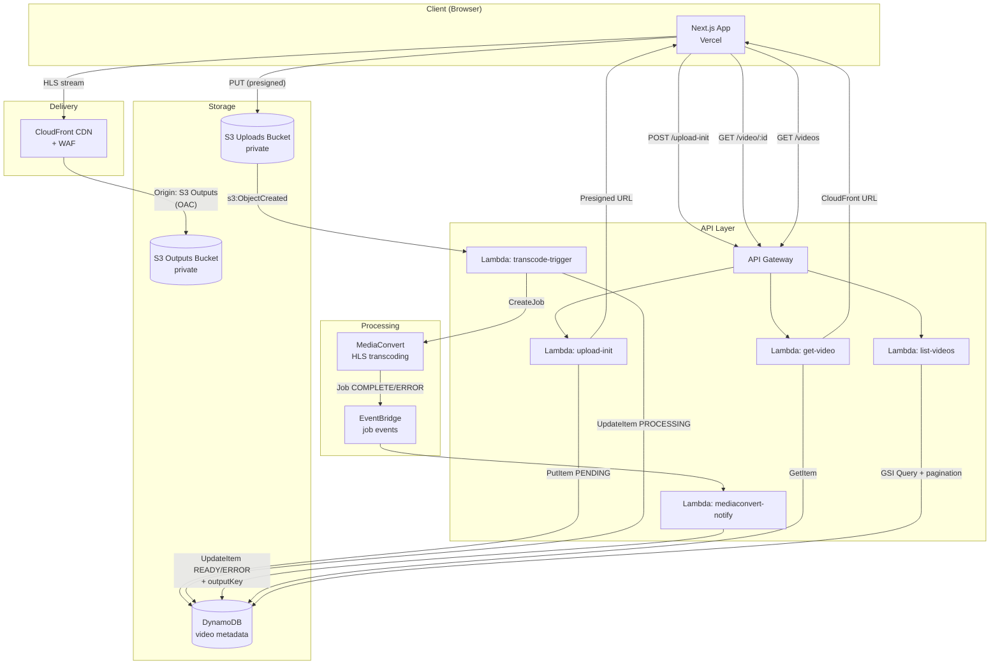
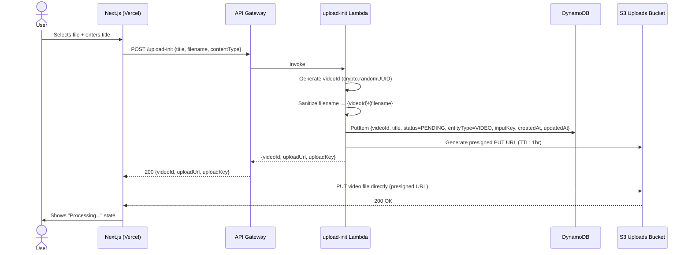
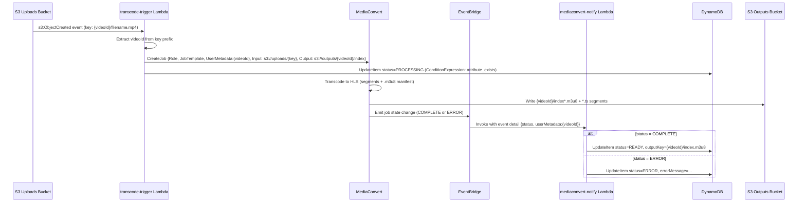
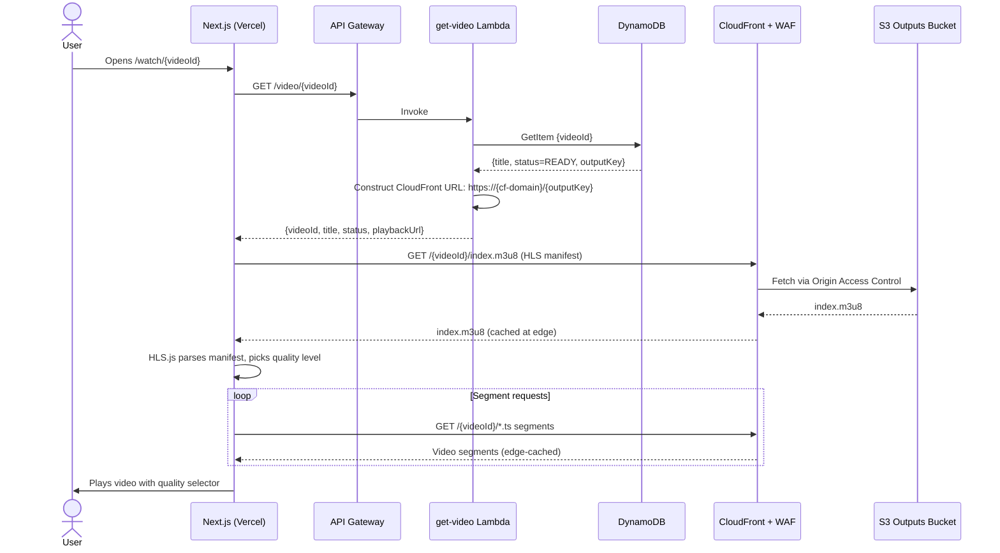

# VOD AWS MVP — Architecture & Design Documentation

> **Project:** Video-on-Demand streaming platform MVP  
> **Stack:** Next.js · AWS Lambda · S3 · MediaConvert · DynamoDB · CloudFront · EventBridge · WAF  
> **Region:** eu-central-1  
> **Last updated:** May 2026

---

## Table of Contents

1. [System Overview](#1-system-overview)
2. [Architecture Diagram](#2-architecture-diagram)
3. [Component Breakdown](#3-component-breakdown)
4. [Data Flow: Upload Pipeline](#4-data-flow-upload-pipeline)
5. [Data Flow: Transcoding Pipeline](#5-data-flow-transcoding-pipeline)
6. [Data Flow: Playback Pipeline](#6-data-flow-playback-pipeline)
7. [API Reference](#7-api-reference)
8. [Data Model](#8-data-model)
9. [Design Decisions (ADRs)](#9-design-decisions-adrs)
10. [Scalability & Availability](#10-scalability--availability)
11. [Security](#11-security)
12. [Monitoring & Observability](#12-monitoring--observability)

---

## 1. System Overview

This MVP implements a complete video-on-demand pipeline: users upload raw video files through a browser UI, the platform automatically transcodes them to HLS format, and delivers the output via a global CDN. The architecture is fully serverless on AWS.

**Key capabilities:**

- Direct-to-S3 upload via presigned URLs (no proxy through backend)
- Automatic HLS transcoding triggered by S3 events
- Event-driven status tracking via EventBridge
- CloudFront delivery with WAF protection
- Infinite-scroll video listing with DynamoDB GSI pagination (newest-first)
- HLS.js player with quality selector in the browser

**Monorepo structure (Turborepo):**

```
apps/
  web/        → Next.js App Router frontend (Vercel)
  lambdas/    → AWS Lambda handlers (manual deploy to eu-central-1)
```

---

## 2. Architecture Diagram




---

## 3. Component Breakdown

### Frontend — `apps/web`


| Component   | Technology                     | Purpose                                                     |
| ----------- | ------------------------------ | ----------------------------------------------------------- |
| Upload page | Next.js App Router             | File picker, title input, progress indicator                |
| Video list  | Next.js + infinite scroll      | Paginated grid via `list-videos` Lambda                     |
| Watch page  | HLS.js player                  | Adaptive bitrate playback with quality selector             |
| API proxy   | Next.js API routes (`app/api`) | Thin proxy to API Gateway; keeps AWS URL out of the browser |


### Lambda Functions


| Name                  | Trigger                                 | Responsibility                                                                                          |
| --------------------- | --------------------------------------- | ------------------------------------------------------------------------------------------------------- |
| `upload-init`         | API Gateway POST                        | Generates `videoId`, writes PENDING row to DynamoDB, returns presigned S3 PUT URL                       |
| `transcode-trigger`   | S3 `ObjectCreated`                      | Starts MediaConvert HLS job using a Job Template; updates DynamoDB to PROCESSING                        |
| `mediaconvert-notify` | EventBridge (MediaConvert state change) | Sets DynamoDB to READY (with `outputKey`) or ERROR                                                      |
| `get-video`           | API Gateway GET                         | Fetches single video metadata + constructs CloudFront playback URL                                      |
| `list-videos`         | API Gateway GET                         | Queries `entityType-createdAt-index` GSI (newest-first) with `nextToken` pagination for infinite scroll |


### AWS Services


| Service                 | Role                                                                                                                                                                                                  |
| ----------------------- | ----------------------------------------------------------------------------------------------------------------------------------------------------------------------------------------------------- |
| **S3 (uploads bucket)** | Receives raw video files via presigned URL. Private; only Lambda has read access.                                                                                                                     |
| **S3 (outputs bucket)** | Stores MediaConvert HLS output (`{videoId}/index*.m3u8`, `.ts` segments). Private; served only via CloudFront OAC.                                                                                    |
| **MediaConvert**        | Transcodes raw video to HLS using a pre-configured Job Template. Outputs per-video folder.                                                                                                            |
| **DynamoDB**            | Metadata store. Single table, `videoId` as partition key. Tracks status lifecycle. GSI `entityType-createdAt-index` (PK: `entityType`, SK: `createdAt`) enables efficient newest-first video listing. |
| **EventBridge**         | Routes MediaConvert job completion/failure events to `mediaconvert-notify` Lambda.                                                                                                                    |
| **CloudFront + WAF**    | Global CDN for HLS delivery. Origin Access Control locks down the outputs bucket. WAF provides rate limiting and basic request filtering.                                                             |
| **API Gateway**         | HTTP API fronting all Lambda functions.                                                                                                                                                               |


---

## 4. Data Flow: Upload Pipeline




**Key design point:** The client uploads directly to S3, not through the application server. This means large video files never pass through Lambda or Vercel, avoiding timeout limits and data transfer costs.

---

## 5. Data Flow: Transcoding Pipeline




**Key design point:** `videoId` is passed as `UserMetadata` to the MediaConvert job so it survives through to the EventBridge notification, allowing the notify Lambda to correlate back to the DynamoDB record without any additional lookup.

---

## 6. Data Flow: Playback Pipeline




---

## 7. API Reference

All endpoints are exposed through API Gateway. The Next.js frontend proxies requests through `app/api` routes, so the API Gateway URL is never exposed to the browser directly.

### POST `/upload-init`

Initialises a video upload. Creates a DynamoDB record and returns a short-lived presigned S3 URL.

**Request body:**

```json
{
  "title": "My Video",
  "filename": "recording.mp4",
  "contentType": "video/mp4"
}
```

**Response `200`:**

```json
{
  "videoId": "550e8400-e29b-41d4-a716-446655440000",
  "uploadUrl": "https://s3.eu-central-1.amazonaws.com/uploads-bucket/550e8400.../recording.mp4?X-Amz-...",
  "uploadKey": "550e8400-e29b-41d4-a716-446655440000/recording.mp4"
}
```

**Notes:**

- `filename` is sanitised (`[^a-zA-Z0-9._-]` → `_`) before use as the S3 key
- The presigned URL expires in **3600 seconds (1 hour)**
- DynamoDB record is written atomically before the URL is returned — if the DB write fails, no URL is issued

---

### GET `/video/{videoId}`

Returns metadata and a CloudFront playback URL for a single video.

**Response `200` (READY):**

```json
{
  "videoId": "550e8400-e29b-41d4-a716-446655440000",
  "title": "My Video",
  "status": "READY",
  "playbackUrl": "https://d1234abcd.cloudfront.net/550e8400-.../index.m3u8",
  "createdAt": "2026-05-01T12:00:00.000Z"
}
```

**Status values:** `PENDING` | `PROCESSING` | `READY` | `ERROR`

---

### GET `/videos`

Returns a paginated list of videos for the infinite-scroll UI.

**Query parameters:**


| Param       | Type              | Description                              |
| ----------- | ----------------- | ---------------------------------------- |
| `nextToken` | string (optional) | Pagination cursor from previous response |
| `limit`     | number (optional) | Page size (default: 20)                  |


**Response `200`:**

```json
{
  "videos": [
    { "videoId": "...", "title": "...", "status": "READY", "createdAt": "..." }
  ],
  "nextToken": "eyJ2aWRlb0lkIjp7..."
}
```

**Notes:** Results are returned newest-first via a `Query` on the GSI. `nextToken` is absent when no more pages exist.

---

## 8. Data Model

### DynamoDB Table:

**Primary key:** `videoId` (String, partition key — no sort key)


| Attribute      | Type              | Set by                | Description                                                                     |
| -------------- | ----------------- | --------------------- | ------------------------------------------------------------------------------- |
| `videoId`      | String (UUID)     | `upload-init`         | Unique identifier, also used as S3 prefix                                       |
| `entityType`   | String            | `upload-init`         | Always `"VIDEO"`. Synthetic partition key for the GSI to enable sorted listing. |
| `title`        | String            | `upload-init`         | User-provided video title                                                       |
| `status`       | String            | All Lambdas           | Lifecycle state: `PENDING` → `PROCESSING` → `READY`                             |
| `inputKey`     | String            | `upload-init`         | S3 key in uploads bucket: `{videoId}/{filename}`                                |
| `outputKey`    | String            | `mediaconvert-notify` | S3 key of HLS manifest: `{videoId}/index.m3u8` (set on READY)                   |
| `errorMessage` | String            | `mediaconvert-notify` | MediaConvert error detail (set on ERROR)                                        |
| `createdAt`    | String (ISO 8601) | `upload-init`         | Creation timestamp                                                              |
| `updatedAt`    | String (ISO 8601) | `upload-init`         | Last update timestamp                                                           |


### GSI:


| Attribute         | Role                                                                                 |
| ----------------- | ------------------------------------------------------------------------------------ |
| `entityType` (PK) | Synthetic partition key, always `"VIDEO"` — groups all videos into one GSI partition |
| `createdAt` (SK)  | ISO 8601 string; sorts lexicographically, which matches chronological order          |


The `list-videos` Lambda queries this GSI with `ScanIndexForward: false` to retrieve videos newest-first. Each page request reads only the items it returns, making it O(page size) rather than O(table size).

### Video Status Lifecycle

```
PENDING → PROCESSING → READY
                     ↘ ERROR
```

- `PENDING`: Record created, upload URL issued, file not yet in S3
- `PROCESSING`: S3 upload confirmed, MediaConvert job started
- `READY`: Transcoding complete, HLS output available at `outputKey`
- `ERROR`: MediaConvert job failed; `errorMessage` contains details

### S3 Key Structure

```
uploads-bucket/
  {videoId}/
    {sanitized-filename}.mp4       ← raw upload

outputs-bucket/
  {videoId}/
    index.m3u8                     ← HLS master manifest
    index_1.ts                     ← video segments
    index_2.ts
    ...
```

---

## 9. Design Decisions (ADRs)

### ADR-001: Direct-to-S3 Upload via Presigned URLs

**Decision:** The client uploads video files directly to S3 using a short-lived presigned PUT URL, rather than routing the file through the application server or Lambda.

**Rationale:**

- Lambda has a payload size limit (6 MB synchronous, 256 KB async). Video files are far larger.
- Routing through Vercel would hit function timeout and memory limits.
- Direct upload removes a network hop, improving upload speed and reducing costs.
- Security is maintained: the presigned URL is scoped to a single object key, expires in 1 hour, and enforces `ContentType`.

**Trade-offs:** The client receives the S3 URL and must handle the upload itself (progress tracking, retries). The frontend is responsible for detecting upload completion and polling for status.

---

### ADR-002: Event-Driven Transcoding via S3 Trigger + EventBridge

**Decision:** Transcoding is initiated by an S3 `ObjectCreated` event rather than a synchronous API call, and completion is handled via EventBridge rather than polling.

**Rationale:**

- Transcoding is long-running (seconds to minutes). Synchronous handling would require Lambda timeouts far beyond practical limits.
- S3 event triggers are reliable and require no additional queue infrastructure for this MVP scale.
- EventBridge natively emits MediaConvert job state changes — no custom notification mechanism needed.
- The `videoId` is threaded through as MediaConvert `UserMetadata`, so the notify Lambda can correlate without a separate lookup.

**Trade-offs:** The pipeline is eventually consistent. There is no built-in retry on partial failure between S3 trigger and MediaConvert. For production, an SQS queue between S3 and the trigger Lambda would add at-least-once delivery guarantees.

---

### ADR-003: HLS as the Streaming Format

**Decision:** MediaConvert outputs HLS (HTTP Live Streaming) exclusively.

**Rationale:**

- HLS is supported natively by Safari/iOS and via HLS.js on all other browsers.
- HLS works well with CDN delivery: segments are static files with predictable cache keys.
- HLS supports adaptive bitrate (ABR) — multiple quality levels in a single manifest — enabling the quality selector in the UI.
- MediaConvert's HLS output goes to S3 as static files, which CloudFront can cache efficiently.

**Trade-offs:** DASH would offer better ABR performance in some scenarios but adds client complexity. HLS is the right pragmatic choice for an MVP.

---

### ADR-004: DynamoDB Single Table + GSI for Video Listing

**Decision:** Use DynamoDB (single table, `videoId` PK) with a GSI for ordered video listing, rather than RDS or another SQL database.

**Rationale:**

- Access patterns are simple and key-based: lookup by `videoId`, ordered listing by creation time.
- No joins or complex queries required.
- DynamoDB scales automatically, has no idle cost at low volume, and works well with Lambda (no connection pool management).
- A GSI on `entityType` + `createdAt` enables efficient newest-first listing via `Query` instead of `Scan`.

**Trade-offs:** The GSI uses a synthetic partition key (`entityType = "VIDEO"`) which puts all videos in a single GSI partition. This is a known DynamoDB pattern acceptable at MVP and moderate scale; at very high item counts, a sharded partition key (e.g. bucketed by month) would distribute the load further.

---

### ADR-005: CloudFront with Origin Access Control (OAC)

**Decision:** The S3 outputs bucket is fully private; CloudFront accesses it via Origin Access Control, not a public bucket policy.

**Rationale:**

- Prevents direct S3 URL access, forcing all traffic through CloudFront (and therefore WAF).
- OAC is the current AWS-recommended approach, superseding the older Origin Access Identity (OAI).
- CloudFront edge caching of HLS segments dramatically reduces S3 GET costs and latency.

**Trade-offs:** HLS segment URLs must go through CloudFront; signed URLs or cookies would be needed to add per-user access control (not implemented in this MVP).

---

### ADR-006: Serverless-First Architecture

**Decision:** All backend compute runs on Lambda with no persistent servers.

**Rationale:**

- Zero idle cost — Lambda charges only for invocations.
- No server management, patching, or scaling configuration.
- Lambda concurrency scales automatically with upload/playback traffic spikes.
- Aligns with the MVP goal of minimising operational overhead.

**Trade-offs:** Lambda cold starts add latency on the first request after idle periods. Provisioned Concurrency would mitigate this for production but adds cost. The MediaConvert client is lazily initialised and cached in `transcode-trigger` to reduce initialisation overhead on warm invocations.

---

## 10. Scalability & Availability

### Upload Pipeline

- **Bottleneck:** None at MVP scale. Presigned URL generation is a single Lambda invocation; the actual file upload goes directly to S3, which handles arbitrary concurrency.
- **Scale path:** S3 supports high request rates per prefix. Sharding by `videoId` UUID prefix is already done; no changes needed.

### Transcoding Pipeline

- **Bottleneck:** MediaConvert has per-account job concurrency limits (default: varies by region and tier). Concurrent uploads beyond this limit will queue automatically; MediaConvert handles the queue.
- **Scale path:** Request a MediaConvert limit increase via AWS Service Quotas. For very high volume, use multiple queues with priority tiers.

### Delivery (Streaming)

- **CloudFront** handles global scale automatically. HLS segments are small, cacheable, and served from the nearest edge location.
- **Scale path:** No changes needed until very high scale. At that point, signed URLs per-viewer and cache policies per quality level would be tuned.

### Database

- **DynamoDB** scales on-demand. The `list-videos` endpoint now uses a `Query` on the `entityType-createdAt-index` GSI, reading only the requested page of items in newest-first order. The previous full-table `Scan` has been replaced.
- **Scale path:** The GSI's single partition (`entityType = "VIDEO"`) is fine for MVP and moderate scale. For very large catalogs, shard the partition key (e.g. by month: `"VIDEO#2026-05"`) and query across shards in parallel.

### Availability


| Component    | Availability Model                                    |
| ------------ | ----------------------------------------------------- |
| Lambda       | Multi-AZ by default; AWS manages failover             |
| S3           | 99.999999999% durability; 99.99% availability per SLA |
| DynamoDB     | Multi-AZ, automatic replication                       |
| CloudFront   | Global edge network; no single point of failure       |
| MediaConvert | Managed service; AWS handles availability             |


The only stateful component the application controls is DynamoDB. All other state (video files, HLS segments) lives in S3, which is effectively durable forever.

---

## 11. Security

### IAM Least Privilege

Each Lambda function has its own IAM role scoped to only the AWS actions it needs:


| Lambda                | Permissions                                                                   |
| --------------------- | ----------------------------------------------------------------------------- |
| `upload-init`         | `s3:PutObject` on uploads bucket, `dynamodb:PutItem` on videos table          |
| `transcode-trigger`   | `mediaconvert:CreateJob`, `dynamodb:UpdateItem`, `iam:PassRole` (for MC role) |
| `mediaconvert-notify` | `dynamodb:UpdateItem`                                                         |
| `get-video`           | `dynamodb:GetItem`                                                            |
| `list-videos`         | `dynamodb:Query` on GSI                                                       |


### S3 Bucket Policies

- **Uploads bucket:** Private. Only `upload-init` Lambda role can write; only `transcode-trigger` Lambda role can read. Public access blocked.
- **Outputs bucket:** Private. Only MediaConvert role can write; CloudFront OAC can read. No Lambda or direct public access.

### CloudFront + WAF

- WAF sits in front of CloudFront, providing rate limiting and protection against common web exploits.
- All HLS delivery goes through CloudFront; direct S3 URLs for outputs are blocked.

### API Gateway

- CORS is configured on the API Gateway to allow requests from the Vercel domain only.
- No authentication on endpoints in this MVP (public read/write). Adding Cognito or a JWT authorizer would be the production next step.

### Presigned URL Security

- Upload URLs expire after 1 hour and are scoped to a single S3 object key.
- `ContentType` is enforced in the presigned URL to prevent uploading arbitrary file types.

---

## 12. Monitoring & Observability

A CloudWatch dashboard (`vod-aws-mvp-dashboard`) is live in `eu-central-1`, covering all services in the pipeline. Metrics refresh every 5 minutes and are displayed as single-value widgets with sparklines for trend visibility.

### Lambda Functions (5 widgets)

Each Lambda has its own widget tracking: `Duration` (avg), `ConcurrentExecutions` (max), `Invocations`, `Errors`, and `Throttles`. The two async Lambdas (`vod-transcode-trigger` and `vod-mediaconvert-notify`) additionally track `AsyncEventsReceived`, `AsyncEventsDropped`, and `AsyncEventAge` (max) — these are the key indicators of pipeline backpressure or dropped events.


| Function                  | Key signals to watch                                                                          |
| ------------------------- | --------------------------------------------------------------------------------------------- |
| `vod-upload-init`         | Errors spike = presign or DynamoDB write failures                                             |
| `vod-transcode-trigger`   | `AsyncEventsDropped > 0` = S3 events being lost; `AsyncEventAge` high = Lambda not keeping up |
| `vod-mediaconvert-notify` | `AsyncEventsDropped > 0` = missed job completions; videos stuck in PROCESSING                 |
| `vod-get-video`           | Duration increase = DynamoDB latency or cold starts                                           |
| `vod-list-videos`         | Duration + `ConcurrentExecutions` = GSI query performance at scale                            |


### API Gateway

Metrics: `Latency` (avg), `IntegrationLatency` (avg), `4xx errors`, `5xx errors`. The gap between `Latency` and `IntegrationLatency` shows overhead added by API Gateway itself. A rising `5xx` rate points to Lambda failures; rising `4xx` points to client-side issues (malformed requests, CORS).

### DynamoDB

Metrics: `ConsumedReadCapacityUnits` (sum), `ConsumedWriteCapacityUnits` (sum), `SuccessfulRequestLatency` per operation (`Query`, `UpdateItem`, `GetItem`, `PutItem`), and `ReturnedItemCount` for `Query`. For `vod-list-videos`, `Query` latency + returned item count + consumed RCUs are the primary efficiency signals.

### MediaConvert

Metrics: `JobsCompletedCount`, `JobsErroredCount`. A non-zero `JobsErroredCount` means a video is stuck in `PROCESSING` and will never reach `READY` without manual intervention. Pair this with `vod-mediaconvert-notify` async metrics for a full picture.

### CloudFront

Metrics: `4xxErrorRate` (avg), `5xxErrorRate` (avg), `Requests` (sum), `BytesDownloaded` (sum). A `5xxError` here means CloudFront cannot reach the S3 outputs bucket (OAC misconfiguration or bucket policy issue). `BytesDownloaded` tracks CDN data transfer costs.

### WAF

Metric: `AllowedRequests`. This is the count of requests that passed WAF rules and reached CloudFront. Monitoring this alongside CloudFront `Requests` helps detect whether WAF is blocking legitimate traffic.

### EventBridge

Rule: `vod-mediaconvert-job-events`

Metrics: `Invocations`, `SuccessfulInvocationAttempts`, `MatchedEvents`. If `MatchedEvents > SuccessfulInvocationAttempts`, EventBridge matched a job completion event but failed to invoke the notify Lambda — videos will be stuck in `PROCESSING`. This should alert immediately.

### CloudWatch Alarms

```
vod-get-video            Errors > 0                          → alert (Lambda error alarm)
vod-list-videos          Errors > 0                          → alert (Lambda error alarm)
vod-mediaconvert-notify  Errors > 0                          → alert (Lambda error alarm)
vod-transcode-trigger    Errors > 0                          → alert (Lambda error alarm)
vod-upload-init          Errors > 0                          → alert (Lambda error alarm)
vod-get-video            Throttles > 0                       → alert (Lambda throttle alarm)
vod-list-videos          Throttles > 0                       → alert (Lambda throttle alarm)
vod-mediaconvert-notify  Throttles > 0                       → alert (Lambda throttle alarm)
vod-transcode-trigger    Throttles > 0                       → alert (Lambda throttle alarm)
vod-upload-init          Throttles > 0                       → alert (Lambda throttle alarm)
vod-mediaconvert-notify  AsyncEventsDropped > 0             → alert (async invocation drops)
vod-transcode-trigger    AsyncEventsDropped > 0             → alert (async invocation drops)
API Gateway m7njx7i0h9   5xx errors > 0                      → alert
MediaConvert Default     JobsErroredCount > 0               → alert
```

### CloudWatch Logs

All Lambda functions log to CloudWatch Logs automatically. Key log events to correlate:

- `vod-upload-init`: `videoId` + presigned URL generation result
- `vod-transcode-trigger`: MediaConvert `jobId` — use this to cross-reference MediaConvert console
- `vod-mediaconvert-notify`: `videoId`, final status (`READY`/`ERROR`), and `errorMessage` on failure

### Tracing

For deeper end-to-end visibility, AWS X-Ray on Lambda and API Gateway might be enabled. This enables tracing a single upload request through the entire pipeline including DynamoDB and MediaConvert calls.